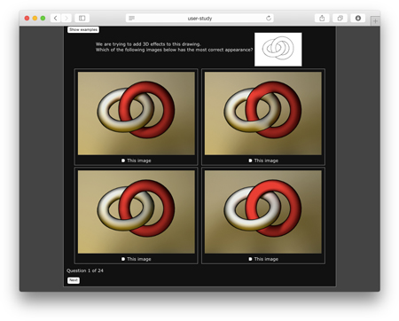

# Web-based perceptual study codebase

This is nothing more than the .php/.javascript/.css/.html files we used to
create the two-/four-alternative forced choice perceptual study for out
Transactions on Graphics paper [Ink-and-Ray: Bas-Relief Meshes for Adding
Global Illumination Effects to Hand-Drawn
Characters](http://dcgi.felk.cvut.cz/home/sykorad/ink-and-ray), [Sýkora et al.
2014].

I've left it in tact as a working demo, and hopeful it's obvious what to edit
to customize.

It is based heavily off of code from [Yotam Gingold](https://github.com/yig).

To get an idea of the client-side interaction, try the [live
version](http://igl.ethz.ch/projects/ink-and-ray/user-study/?experiment=2AFC).

On the server-side, upon completion of the survey simple plain text files of
the responses in json format are generated and saved into:

    /data/[experiment name]/[unique id].txt

Then you can suck out the individual data entries in batch using your favorite
command line tools/scripting languages.

> If your institution/government requires it, you might consider placing your
> IRB approval information on the first page of the survey.
